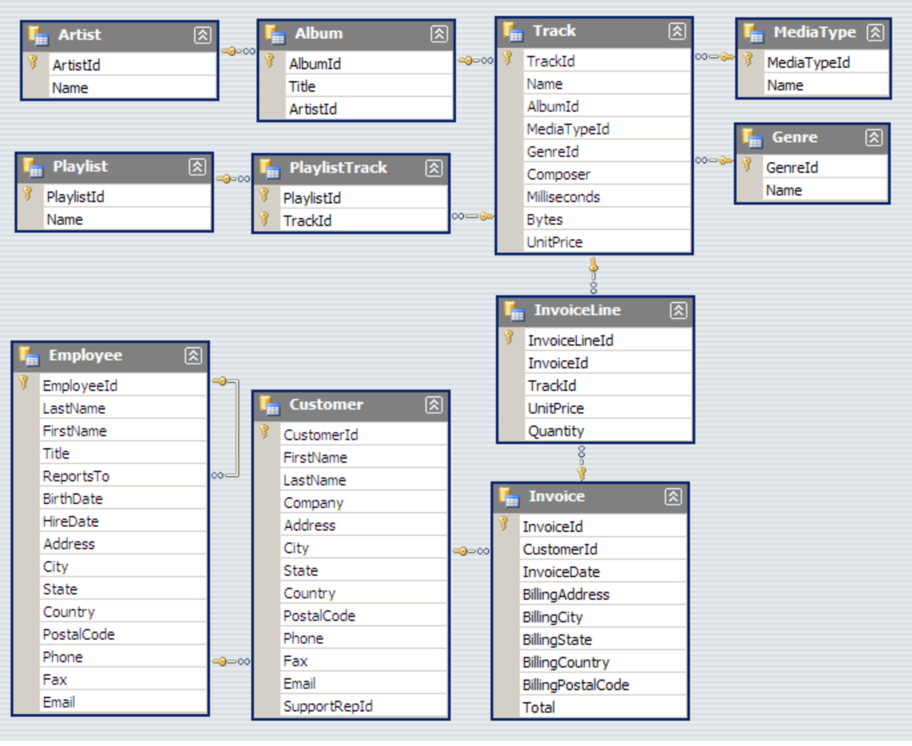

# Mining the Chinook Database with SQL and Python

In this project I'll be using SQL and Python together to mine a simple SQLite database to answer specific business questions.

### Helper Function
To assist with the interaction of these two languages, I'll create a helper function to run SQL queries in the Python environment. I'll use this to extract data from the database into Python dataframes, so it can then be further manipulated and visualised with Python as desired.

### Chinook Database
I'll be accessing the Chinook database, a sample data base representing a digital music store, with tables for artists, albums, media tracks, invoices and customers, created using real data from an iTunes Library.

More details about the Chinook database can be found [here](https://github.com/lerocha/chinook-database/tree/master/ChinookDatabase). A copy of the database schema can be found [here](https://github.com/lerocha/chinook-database/wiki/Chinook-Schema)

**Chinook Schema:**

Source: [Github](https://github.com/lerocha/chinook-database/wiki/Chinook-Schema)

## Create Helper Function to Quickly Execute SQL Queries
  
`run_query()`  
This will take an SQL query as an argument and return the results of that query in a pandas dataframe. It also makes use of a [context manager](https://jeffknupp.com/blog/2016/03/07/python-with-context-managers/) to open and close the database connection.

*Note:* As this function will be reading the results into a dataframe, this will be used exclusively for `SELECT` statements.
